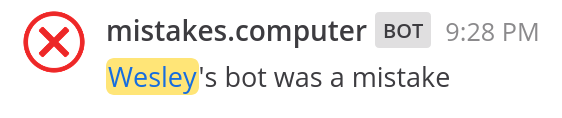

mistakes.computer
=================

A silly project to try out [Deno Deploy]. Picks a random thing that was a
mistake (most of which the application uses 😅). Provides a website,
JSON endpoint, and [Mattermost] slash command.

### Endpoints

* Website: <https://mistakes.computer/>
* JSON: <https://mistakes.computer/mistake.json>
* Slash command: `/mistake Wesley's bot was` 
  

Local Development
-----------------

For local development you need [Deno].

Run the local server:

    deno run -A --no-check=remote src/index.tsx

Run the tests:

    deno test

License
-------

MIT

[Deno]: https://deno.land/
[Deno Deploy]: https://deno.com/deploy
[Mattermost]: https://mattermost.com/
